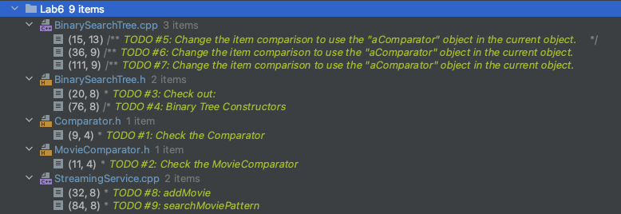
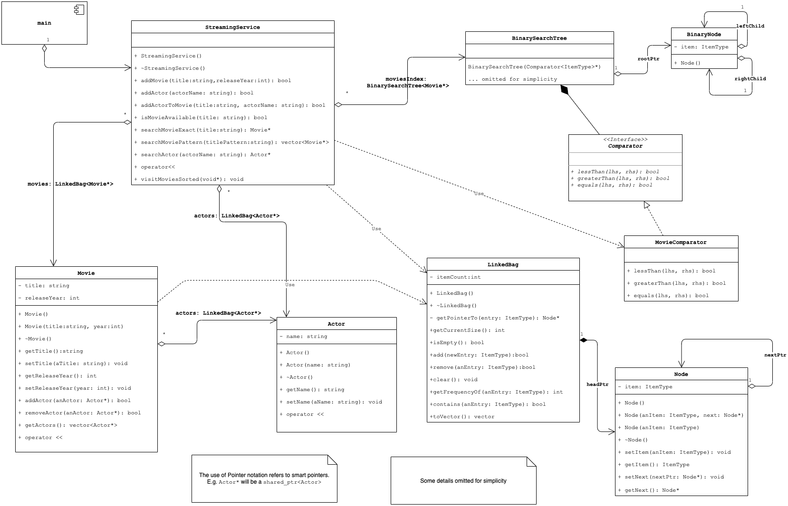

# Laboratory #6 - Use of ADT Binary Search Tree

-----
**CSCI2421 - Summer 2021**

### **_Team Members Names:_**
- Student #1: `Artur Ayzenberg`
- Student #2: `Jack Hurd`

### **Lab Status**
```text
Describe **briefly** how complete your lab is, and how did you tested it.
Does it work on CSEGrid?
```

-----

## TODO:
1. Complete your and your teammates' names on the top of this document.
1. Open the **TODO tab** on CLION, and complete the implementation. (Image below shows a snapshot of that).
1. **Document your code**, as described on Canvas.
1. All team members should be working concurrently using **code-with-me on Clion**.
1. If you have questions, use Zoom _"Ask for help button"_ on the toolbar (bottom), and the instructors will get to
   your room asap. You can also use Slack concurrently.
1. **Please keep your camera turned on, so you can interact with your team.**
1. Instructors will be walking through the rooms regularly.
1. Push your solution to GitHub
1. Pull your solution from git into CSEGrid
1. Compile it and run it on CSEGrid using `make`.
1. **Capture a screenshot and save it on your CLion Project folder.**
1. Complete the *Lab Status* section on this document.
1. Complete Discussion.




## Submission
- Complete the lab.
- On CLion execute Build --> Clean from the menu (this will remove all temporary files)
- Using zip, compress the entire CLion Project and upload it to canvas before 11:59am.
    - Remember to add your CSE grid screenshot to your sources folder!
- **LATE SUBMISSIONS**
    - The assignment will be open till 3pm.
    - Submitting after 11:35am will imply a 20% penalty.
    - Submit your lab to your Lab 6 assignment on Canvas.
- Zoom session will close after our class time    


## Domain Description
We will continue working on the Streaming Service topic we developed in _Lab #1_ and _Lab #2_.
Nonetheless, most domain is already implemented for you and you will focus on the use and implementation of BST.

Also, we will learn how to partially match strings using regular expressions. 
Here is a link with [documentation](https://en.cppreference.com/w/cpp/regex/regex_match).


